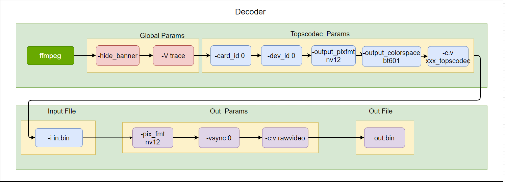

# FFmpeg-GCU

本插件适用于enflame GCU300 以上版本。
适用ffmpeg版本3.2, 4.4，5.0，5.1.

为了适配ffmpeg多版本，除了topscodec新增加的文件外，其余在现有ffmpeg 框架代码下修改的文件全部采用shell脚本增删相关内容，所以编译需要的ffmpeg版本必须是官方ffmpeg文件。

其中n3.2不包含avs，av1解码器。

## 如何编译？

下载tops-codec-headers项目，在tops-codec-headers文件夹中执行：
```
make install
```
安装topsruntimes以及topscodec相关头文件。

然后再plugin文件夹中执行，
```
./build_ffmpeg.sh n3.2
```
详细的编译选项可以参考
```
./build_ffmpeg.sh -h
```
完成编译后会生成deb包。


## 如何使用？

### GCU 设备的选择

Codec 的设备节点在/dev 目录下，标准形式为/dev/gcuXvidY，其中`X`指的是卡号，`Y`指的是卡中的设备号，具体可用设备数量取决于在创建虚拟机时划入的设备数量。

### Codec 格式与插件名称的对应关系

|  Codec 格式  |    插件名称     |
| :----------: | :-------------: |
|     AV1      |  av1_topscodec  |
| HEVC (H.265) | hevc_topscodec  |
| AVC (H.264)  | h264_topscodec  |
|     AVS      |  avs_topscodec  |
|     AVS2     | avs2_topscodec  |
|     VP8      |  vp8_topscodec  |
|     VP9      |  vp9_topscodec  |
|     JPEG     | mjpeg_topscodec |
|     VC‑1     |  vc1_topscodec  |
|    MPEG4     | mpeg4_topscodec |
|    MPEG2     | mpeg2_topscodec |
|    H.263     | h263_topscodec  |
|  RealVideo   |       N/A       |

### 支持的参数

- FFmpg_GCU 支持的参数

| 参数              | 使用                      | 备注        |
| ----------------- | ------------------------- | ---------- |
| vcodec            | -vcodec h264_topscodec    | 参数见上表插件名称          |
| card_id           | -card_id 0                | 范围 0~8（具体根据服务器实际情况而定）   |
| device_id         | -device_id 0              | 范围 0-8（具体根据服务器实际情况而定）   |
| hw_id             | -hw_id 15                 | default 15                            |
| sf                | -sf 0                     | 0-500（具体根据实际情况而定）         |
| in_w              | -in_w 1096                | 如果解码视频是avs2，尽量设置该参数      |
| in_h              | -in_h 1080                | 如果解码视频是avs2，尽量设置该参数      |
| in_port_num       | -in_port_num 15           | 2-24（default 8）                    |
| out_port_num      | -out_port_num 15          | 2-24（default 8）                    |
| zero_copy         | -zero_copy 0              | 1/0                                  |
| output_pixfmt     | -output_pixfmt nv12       | 参数见下表 output_pixfmt              |
| output_colorspace | -output_colorspace bt2020 | 参数见下表 output_colorspace          |
| enable_crop       | -enable_crop 1            | 0/1                                  |
| crop_top          | -crop_top x               |                                      |
| crop_bottom       | -crop_bottom x            |                                      |
| crop_left         | -crop_left x              |                                      |
| crop_right        | -crop_right x             |                                      |
| enable_rotation   | -enable_rotation 1        | 0/1                                  |
| rotation          | -rotation 90              | 90/180/270                           |
| enable_resize     | -enable_resize 0          | 0/1                                  |
| resize_w          | -resize_w x               | <= 原始w                             |
| resize_h          | -resize_h x               | <= 原始h                             |
| resize_m          | -resize_m 0               | 0/1                                  |
| sfo               | -sfo 0                    | 0-INT_MAX                            |
| idr               | -idr 0                    | 0/1                                  |

1. 参数 resize_m 指 downscale 的模式，0-Bilinear, 1-Nearest。
2. 参数 sfo 指抽帧间隔。
3. 参数 idr 指只输出 IDR 关键帧,为1时表示只输出关键帧。
4. 参数 sf 指解码优化参数，单路解码设置为 0，多路解码设置为 1-500之间，具体要根据实际情况确定。

- 支持的输出格式 output_pixfmt

| index | avformat                            | str       |
| ----- | ----------------------------------- | --------- |
| 1     | AV_PIX_FMT_YUV420P                  | yuv420p   |
| 2     | AV_PIX_FMT_RGB24                    | rgb24     |
| 3     | AV_PIX_FMT_BGR24                    | bgr24     |
| 4     | AV_PIX_FMT_RGB24P                   | rgb24p    |
| 5     | AV_PIX_FMT_BGR24P                   | bgr24p    |
| 6     | AV_PIX_FMT_YUV444P                  | yuv444p   |
| 7     | AV_PIX_FMT_GRAY8                    | gray8     |
| 8     | AV_PIX_FMT_NV12                     | nv12      |
| 9     | AV_PIX_FMT_NV21                     | nv21      |
| 10    | AV_PIX_FMT_YUV444P10LE              | yuv444ple |
| 11    | AV_PIX_FMT_P010LE(topscodec p010)   | p010      |
| 12    | AV_PIX_FMT_P010BE(topscodec p010le) | p010le    |
| 13    | AV_PIX_FMT_GRAY10LE                 | gray10    |

提示说明：ffmpeg topscodec online 8bit->10bit 的转换：

1. 字节左移（<<） 2bit,然后补 0，如果为小端，左移后的高位在大地址，例如某一个字节为 0xeb(1110 1011)转换后就成为了 0xac03(1010 1100 0000 0011)，以此类推。
   - yuv420p->gray10 提取 Y 分量，将 Y 分量中的每一个字节（8bit)，然后按照上述操作每一个字节。
   - yuv420p->p010le 重新排列 YCrCb 为 YYY...CrCbCrCbCrCb...，然后按照上述操作每一个字节。
2. 单纯的增加一个 0x00 的字节就可以了，比如原始字节为 0xeb(1110 1011)，那么转到 10bit 后就成了 0x00 eb 或者 0xeb 00。
   - yuv420p->p010 重新排列 YCrCb 为 YYY...CrCbCrCbCrCb...，然后按照上述操作每一个字节。
   - yuv420p->yuv444p10，插值 CrCb 分量，最后为 YYY...CrCrCr...CbCbCb...，然后按照上述方式操作每一个字节。

- 支持的颜色空间 output_colorspace

| index | colorspace |
| ----- | ---------- |
| 1     | bt601      |
| 2     | bt601f     |
| 3     | bt709      |
| 4     | bt709f     |
| 5     | bt2020     |
| 6     | bt2020f    |

# 安装使用

FFmpeg_GCU 依赖 TopsRider 软件栈，需要同时安装 TopsRider 软件栈和 FFmpeg_GCU，然后进行相关的使用。

FFmpeg_GCU 采用源码 release 的方式，目前源代码直接 release 在安装包中，后期会提供开源网站的链接供客户下载，源代码 release 分两部分：

- FFmpeg_GCU 依赖的头文件（实现底层库的动态加载）。
- FFmpeg_GCU 插件本身。

安装 FFmpeg_GCU 的 deb 文件后，可以拿到预编译好的可执行文件和源代码，在头文件目录运行 make 命令即可把头文件安装到系统目录，然后在插件目录进行 FFmpeg 的编译，这里假定用户具备了 FFmpeg 编译的相关知识背景，因此没做详细介绍。

# 应用举例

## FFmpeg 命令行

FFmpeg 命令行解码的设置（为了防止 ffmpeg 根据 pts 进行抽帧和插帧，增加-vsync 0，另外-hide_banner 是隐藏编译说明信息，-v trace 是打开 log，可以根据实际情况添加或者删除）。



- 使用第 0 张卡上的第 0 个 dev 的 h264_topscodec 解码器，解码 in.bin 并输出到 out.bin，默认输出格式为 yuv420p
  - `ffmpeg -hide_banner -v trace -card_id 0 -device_id 0 -c:v h264_topscodec -i in.bin -c:v rawvideo -vsync 0 out.bin`
- 使用第 0 张卡上的第 0 个 dev 的 h264_topscodec 解码器，并且使用 online 中的 csc 功能，将 in.bin 解码后的 yuv420p 转换为 Output Pixel 后输出到 out.bin
  - `ffmpeg -hide_banner -v trace -card_id 0 -device_id 0 -output_pixfmt nv12  -output_colorspace bt601 -c:v h264_topscodec -i in.bin -pix_fmt nv12  -c:v rawvideo -vsync 0 out.bin`

## FFmpeg C API

下面代码展示了 FFmpeg 调用 topscodec 的关键 api 使用。

<!-- 具体代码请参考doc/samples/decode_tops.c和doc/samples/hw_decode_tops.c两个案例文件 -->

```c++
/*
本例展示了如何在ffmpeg api中调用到topscodec解码器插件
*/
int main(int argc, char** argv){
    int ret;
    AVFormatContext *input_ctx = NULL;
    AVStream        *video     = NULL;

    AVCodec       *decoder     = NULL;
    AVCodecContext *decode_ctx = NULL;
    AVDictionary  *dec_opts    = NULL;

    char *inf_file = "test.264"

    if (avformat_open_input(&input_ctx, in_file, NULL, NULL) != 0) {
        fprintf(stderr, "Cannot open input file '%s'\n", in_file);
        return -1;
    }

    if (avformat_find_stream_info(input_ctx, NULL) < 0) {
        fprintf(stderr, "Cannot find input stream information.\n");
        return -1;
    }

    for (size_t i = 0; i < input_ctx->nb_streams; i++) {
        if (input_ctx->streams[i]->codecpar->codec_type ==
            AVMEDIA_TYPE_VIDEO) {
            video = input_ctx->streams[i];
            video_stream = i;
            break;
        }
    }

    if (NULL == video) {
        fprintf(stderr, "video stream is NULL\n");
        return -1;
    }

    switch(video->codecpar->codec_id) {
    case AV_CODEC_ID_H264:
        decoder = avcodec_find_decoder_by_name("h264_topscodec");     break;
    case AV_CODEC_ID_HEVC:
        decoder = avcodec_find_decoder_by_name("hevc_topscodec");     break;
    case AV_CODEC_ID_VP8:
        decoder = avcodec_find_decoder_by_name("vp8_topscodec");      break;
    case AV_CODEC_ID_VP9:
        decoder = avcodec_find_decoder_by_name("vp9_topscodec");      break;
    case AV_CODEC_ID_MJPEG:
        decoder = avcodec_find_decoder_by_name("mjpeg_topscodec");    break;
    case AV_CODEC_ID_H263:
        decoder = avcodec_find_decoder_by_name("h263_topscodec");     break;
    case AV_CODEC_ID_MPEG2VIDEO:
        decoder = avcodec_find_decoder_by_name("mpeg2_topscodec");    break;
    case AV_CODEC_ID_MPEG4:
        decoder = avcodec_find_decoder_by_name("mpeg4_topscodec");    break;
    case AV_CODEC_ID_VC1:
        decoder = avcodec_find_decoder_by_name("vc1_topscodec");      break;
    case AV_CODEC_ID_CAVS:
        decoder = avcodec_find_decoder_by_name("avs_topscodec");      break;
    case AV_CODEC_ID_AVS2:
        decoder = avcodec_find_decoder_by_name("avs2_topscodec");     break;
    case AV_CODEC_ID_AV1:
        decoder = avcodec_find_decoder_by_name("av1_topscodec");      break;
    default:
        decoder = avcodec_find_decoder(video->codecpar->codec_id);  break;
    }

    decode_ctx = avcodec_alloc_context3(decoder);

    av_dict_set(&dec_opts, "device_id", dev_id, 0);
    av_dict_set(&dec_opts, "output_pixfmt", out_fmt, 0);
    /*+++++++++++++++++++++++++++++++++++++++++++++++++++++*/
    // examples for other options:
    // 1. set the in_port_num/out_port_num
    // av_dict_set(&dec_opts, "in_port_num", "6", 0);
    // av_dict_set(&dec_opts, "out_port_num", "6", 0);
    // 2. set the zero_copy
    // av_dict_set(&dec_opts, "zero_copy", "1", 0);
    // 3. set the rotation (only support orientation,90/180/270)
    // av_dict_set(&dec_opts, "enable_rotation", "1", 0);
    // av_dict_set(&dec_opts, "rotation", "90", 0);
    // 4. set the crop
    // (w * h)
    // (0,0)-------------------------------------------+
    // +              |              |                 +
    // +            crop_top         |                 +
    // +              |              |                 +
    // +---crop_left--+              |                 +
    // +                             |                 +
    // +                           crop_bottom         +
    // +                             |                 +
    // +--------------crop_right-----+                 +
    // +                                               +
    // +-------------------------------------------(w,h)
    // av_dict_set(&dec_opts, "enable_crop", "1", 0);
    // av_dict_set(&dec_opts, "crop_left", "20", 0);
    // av_dict_set(&dec_opts, "crop_top", "20", 0);
    // av_dict_set(&dec_opts, "crop_right", "1900", 0);
    // av_dict_set(&dec_opts, "crop_bottom", "1060", 0);
    // 5. set the resize (0-Bilinear, 1-Nearest)
    // av_dict_set(&dec_opts, "enable_resize", "1", 0);
    // av_dict_set(&dec_opts, "resize_w", "640", 0);
    // av_dict_set(&dec_opts, "resize_h", "360", 0);
    // av_dict_set(&dec_opts, "resize_m", "0", 0);
    // 6. set the idr_only (only decode the IDR frame)
    // av_dict_set(&dec_opts, "idr", "1", 0);
    // 7. set the interval (decode the frame every interval)
    // if interval is 2, x00x00x00x00x.., x is the frame, 0 is the discard frame
    // av_dict_set(&dec_opts, "sfo", "2", 0);
    // 8. set the balance rate (0-300)
    // recommend value:single core:0, multi-core:5
    // av_dict_set(&dec_opts, "sf", "5", 0);
    // 9. set the output_colorspace
    // support bt601, bt709, bt2020, bt601f, bt709f, bt2020f
    // av_dict_set(&dec_opts, "output_colorspace", "bt709", 0);
    /*+++++++++++++++++++++++++++++++++++++++++++++++++++++*/

    if ((ret = avcodec_open2(decode_ctx, decoder, &dec_opts)) < 0) {
        fprintf(stderr, "Failed to open codec for stream #%d\n",
                video_stream);
        return -1;
    }

    /*fmt_Ctx为 demux部分，本示例代码中略去*/
    while(1) {
        ret = av_read_frame(fmt_ctx, &packet);
        if ((ret = av_read_frame(input_ctx, &packet)) < 0)
            break;
        ret = avcodec_send_packet(dec_ctx, &packet);
        if (ret < 0) {
            av_log(dec_ctx, AV_LOG_ERROR,
                "send pkt failed, ret(%d), %s, %d\n",
                ret, __FILE__, __LINE__);
            goto fail;
        }

        while (ret >= 0 || eos) {
            ret = avcodec_receive_frame(dec_ctx, p_frame);
            if (ret == AVERROR_EOF) {
                av_log(g_dec_ctx, AV_LOG_INFO, "dec receive eos\n");
                av_frame_unref(p_frame);
                av_frame_free(&p_frame);
                return 0;
            } else if (ret == 0) {
                save_yuv_file(dec_ctx, p_frame);
                av_frame_unref(p_frame);
            } else if (ret < 0 && ret != AVERROR(EAGAIN)) {
                av_log(dec_ctx, AV_LOG_ERROR, "receive frame failed\n");
                goto fail;
            }
        }
        av_packet_unref(&packet);
    }

fail:
     avcodec_free_context(&decode_ctx);
     return 0;
}
```

## OpenCV C++ API

OpenCV 版本需要 3.4.2 及以上

在 OpenCV 中使用 FFmpeg 功能的时候，需要先安装 FFmpeg 到/usr/local 目录下，一般官方默认的安装包中是带有 FFmpeg 支持的，所以只要把 FFmpeg 安装后，在 OpenCV 中就可以直接调用 FFmpeg 的 API。

如果报错可以尝试重新编译，具体编译方式参考下面命令：

```bash
cd OpenCV
mkdir build
cd build
cmake -D OPENCV_GENERATE_PKGCONFIG=YES ..
make -j4
make install
```

采用 OpenCV 的时候需要注意以下几点：

1）不要使用 FFmpeg topscodec 中的任何 online 参数，OpenCV 会默认采用 FFmpegg 的相关 fileter 进行 yuv2bgr 和 resize 的操作。

2）OpenCV 会将 FFmpeg topscodec 解码后的数据自动进行 YUV2BGR 转换，并且自动进行设备到主机之间数据的拷贝，这个操作极为耗时。

OpenCV 提供了`VideoCapture`类来提供获取视频帧的功能，其中包括视频文件的解码功能，详细的 API 介绍可以参考 OpenCV 社区提供的文档。

https://docs.opencv.org/3.4.2/d8/dfe/classcv_1_1VideoCapture.html

OpenCV 调用 FFmpeg topscodec 相关代码片段如下：

```c++
/*
本案例主要介绍了，如何使用Opencv api 去调用ffmpeg topscodec 插件的方法
*/
#include <iostream>
#include "opencv2/core/cvdef.h"
#include "opencv2/core/utils/logger.hpp"
#include "opencv2/opencv.hpp"

int main(int argc, char **argv) {
    if (argc != 2) {
        printf(
            "usage: %s  input_file only support h264\n"
            "API example program to show how to read"
            "frames from an input file.\n"
            "This program reads frames from a file,"
            "decodes them, and writes decoded\n"
            "video frames to a jpeg file\n",
            argv[0]);
        exit(1);
    }

    cv::utils::logging::setLogLevel(cv::utils::logging::LOG_LEVEL_DEBUG);
    //OpenCV的Mat数据结构，用于存储获取到的数据帧
    cv::VideoCapture capture;
    //OpenCV的Mat数据结构，用于存储获取到的数据帧
    cv::Mat          frame;

    /*
    * 设置环境变量 OPENCV_FFMPEG_CAPTURE_OPTIONS=video_codec;h264_topscodec
    * 上面设置的含义为：ffmpeg的解码器选择h264_topscodec，
    * 类似于ffmpeg中的-vcodec h264_topscodec
    * 如果设置了多个option参数，可以通过'|'来分割：
    * OPENCV_FFMPEG_CAPTURE_OPTIONS=video_codec;
    * h264_topscodec|device_id;1|zero_copy;0
    * 上述设置相当于ffmpeg中的ffmpeg -zero_copy 0 -device_id 1 -vcodec
    * h264_topscodec -i test.264 xxx
    * 注意一点的是，上述全局变量的设置只针对Opencv3.4.2及以上的版本
    * Opencv3.4.1及以下的版本如果要使用ffmpeg指定的解码器，
    * 需要在configure ffmpeg的时候只打开你需要的那个 解码器就可以了。
    */
    putenv("OPENCV_FFMPEG_CAPTURE_OPTIONS=video_codec;h264_topscodec");
    /*
    *设置ffmpeg中的log levle
    */
    putenv("OPENCV_FFMPEG_LOGLEVEL=48");
    putenv("OPENCV_FFMPEG_DEBUG=1");
    char *infile = argv[1];
    /*
    *打开文件，值得要注意的是，TopsVideo通过FFmpeg提供解码的后端支持，
    *因此一定要增加cv::CAP_FFMPEG的选择
    */
    if (!capture.open(infile, cv::CAP_FFMPEG)) {
        printf("can not open infile %s ...\n", infile);
        return -1;
    }

    int num = 0;
    while (capture.read(frame)) {//读取解码得到的视频帧
        if (frame.empty())
            break;
        //后续视频帧的处理，跟OpenCV的Mat的操作，完全一致
        num++;
        printf("frame=%d\n", num);
        std::string name = "save_" + std::to_string(num) + ".jpg";
        imwrite(name, frame);
    }

    printf("end of stream,num=%d!\n", num);
    capture.release();
    return 0;
}
```

## Py-AV Python API

PyAV: https://github.com/PyAV-Org/PyAV

PyAV 提供了一套 python 接口来调用 FFmpeg api 接口，下面主要介绍如何通过 PyAV 调用到 FFmpeg_GCU。因为这里使用我们自己的芯片做加速，所以首先安装我们的 FFmpeg，然后安装在/usr/local 目录下。

安装 Py-AV，选择不安装官方的 FFmpeg，`pip install av --no-binary av`

### Parser + decoder

下面的案例是通过调用 codec 内部内置的 parser 来解析 h264packet，这里只支持 annexb 格式，不支持 avcc 格式。

```py
import os
import subprocess
import logging
import time

logging.basicConfig(level=logging.DEBUG)
logging.getLogger('libav').setLevel(logging.DEBUG)

import av
import av.datasets

# We want an H.264 stream in the Annex B byte-stream format.
# We haven't exposed bitstream filters yet, so we're gonna use the `FFmpeg` CLI.
h264_path = "libx264_640x360_baseline_5_frames.h264"

if not os.path.exists(h264_path):
    subprocess.check_call(
        [
            "FFmpeg",
            "-i",
            av.datasets.curated("zzsin_1920x1080_60fps_60s.mp4"),
            "-vcodec",
            "copy",
            "-an",
            "-bsf:v",
            "h264_mp4toannexb",
            h264_path,
        ]
    )

fh = open(h264_path, "rb")

#此处选择h264_topscodec 作为解码器
codec = av.CodecContext.create("h264_topscodec", "r")
#设置参数
codec.options={"card_id":"0","dev_id":"1","hw_id":"15"}
#打开解码器
codec.open()
print(codec.name)
first= True
count=0
while True:
    chunk = fh.read(1 << 16)
    packets = codec.parse(chunk)
    print("Parsed {} packets from {} bytes:".format(len(packets), len(chunk)))

    for packet in packets:
        print("   ", packet)
        frames = codec.decode(packet)

        if first:
            time.sleep(2)
            first=False
        for frame in frames:
            print("       ", frame)
            count+=1
            print('--count:%d--'%count)
            frame.to_image().save("night-sky.{:04d}.jpg".format(count),quality=80,)

    # We wait until the end to bail so that the last empty `buf` flushes
    # the parser.
    if not chunk:
        break

p=av.Packet(None)
print("send eos:", p)
frames = codec.decode(p)
for frame in frames:
    print("       ", frame)
    count+=1
    print('--count:%d--'%count)
    frame.to_image().save("night-sky.{:04d}.jpg".format(count),quality=80,)

codec.close()
fh.close()
print('all count:%d'%count)
```

### demuxer1 + decoder

这个案例要注意一点，它是无法通过参数设置调用到 FFmpeg_GCU 解码器中的解码器。如果非要用，只能编译 FFmpeg_GCU 的时候关闭除了 topscodec 外的所有解码器

```py
import time

import av
import av.datasets

container = av.open('ocr_400_400_5_frames.mp4')
first=True

count=0
start_time = time.time()
for packet in container.demux():
    print(packet)
    for frame in packet.decode():
        print(frame)
        count+=1
        print('---frame:%d---'%count)
    if first:
        time.sleep(2)
        first=False

auto_time = time.time() - start_time
container.close()
print('all frame:%d',count)

```

### demuxer2 + decoder

这个案例是采用 demuxer+codec decoder 的案例，为什么不直接使用 demux 中自带的 decoder 呢？这是因为其无法通过设置来选择解码器。所以我们不得不采用这种曲折迂回的办法来进行解码。

```py
import os
import subprocess
import logging
import time

import av

logging.basicConfig(level=logging.DEBUG)
logging.getLogger('libav').setLevel(logging.DEBUG)

h264_path = "ocr_400_400_5_frames.mp4"
container = av.open(h264_path,options={"vsync":"0"})
in_stream = container.streams.video[0]

codec = av.CodecContext.create("h264_topscodec", "r")
codec.options={"card_id":"0","device_id":"0"}
codec.open()
print(codec.name)
# print(codec.extradata_size)


first=True
num = 0

for packet in container.demux(in_stream):
    print('----packet---')
    packet.dts =0
    packet.pts = 0
    print("   ", packet)

    #这里一定要注意将demux中codec的extradata赋值到这里打开的codec.extradata中
    codec.extradata =in_stream.codec_context.extradata

    frames = codec.decode(packet)
    print('---after decode---')
    if first:
        time.sleep(2)#第一次等待2s,等待解码器初始化准备好
        first=False
    for frame in frames:
        print("       ", frame)
        num+=1
        print('-----frame:%d-----'%num)

print('all:%d'%num)
codec.close()
input_.close()

```

## imageio.v3 + ffmpeg  Sample

下面的例子展示了如何通过imageio.v3来调用ffmpeg-gcu的topscodec插件对jpg文件解码，下面用到了topscodec的decoder + csc(颜色空间转换) + resize硬件加速。

```python
import imageio.v3 as iio

# 执行该文件前需要指定ffmpeg-gcu的地址(不要用默认安装的标准ffmpeg)：export IMAGEIO_FFMPEG_EXE=/bin/ffmpeg
# https://imageio.readthedocs.io/en/stable/formats/formats_by_plugin.html
# ffmpeg支持扩展名:avi, mkv, mov, mp4, mpeg, mpg, WEBCAM, webm, wmv
# 如果是jpg文件，需要指定解码器为mjpeg_topscodec，并且文件后缀名改为mpg

# 指定输入文件，支持扩展名:avi, mkv, mov, mp4, mpeg, mpg, WEBCAM, webm, wmv
path="./in.mpg"
# 指定卡号
card="0"
# 指定设备号
device="0"
# 指定解码器
decoder="mjpeg_topscodec"
# 指定色彩空间
colorspace="bt601"
# 指定输出格式
out_fmt="rgb24"
# 是否启用resize 0/1
enable_resize="1"
# resize宽度
resize_w="200"
# resize高度
resize_h="200"

input=['-card_id', card,
       "-device_id", device,
       '-vcodec', decoder,
       '-output_pixfmt',out_fmt,
       '-output_colorspace',colorspace,
       '-enable_resize',enable_resize,
       '-resize_w',resize_w,
       '-resize_h',resize_h,
       ]
output=['-pix_fmt', out_fmt,
       '-c:v','rawvideo',
       ]

# reading:
img = iio.imread(path, plugin="FFMPEG", input_params=input, output_params=output)
#do something with img
print(img.shape) #(num_frames, height, width, channel) (1, 200, 200, 3)
# writing:
iio.imwrite("out.jpg", img)
```